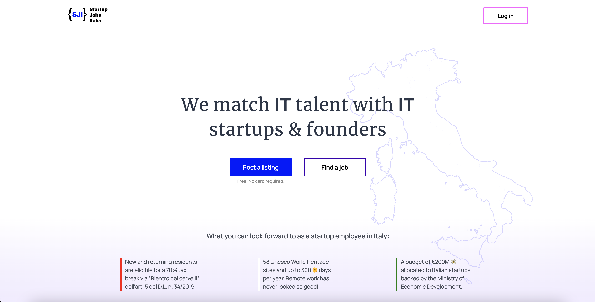

# Startup Jobs Italia 

## Description

This is the codebase for Startup Jobs Italia, a free job board for early Italian startups and founders. Users can log in and publish jobs for free, and they can also post a listing if they are seeking a job with a startup or a co-founder, CTO, etc. The site was inspired by startupmatcher.com, a Norwegian site that helped me land my first tech gig in Oslo in 2019. 

## Technologies Used

- Next.js
- React
- Supabase
- OAuth
- CSS modules
- Figma
- Vercel

